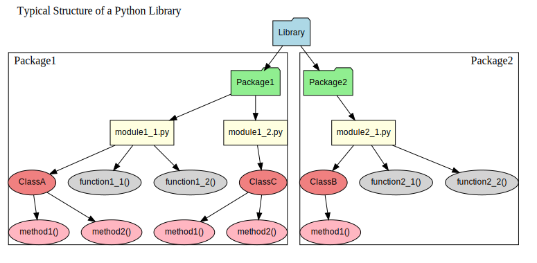

# Documentation

Put the documentation for the library in this folder. Typically, you would write the documentation in Markdown or
reStructuredText files.

## Example

Example of including an image is shown below:

  

